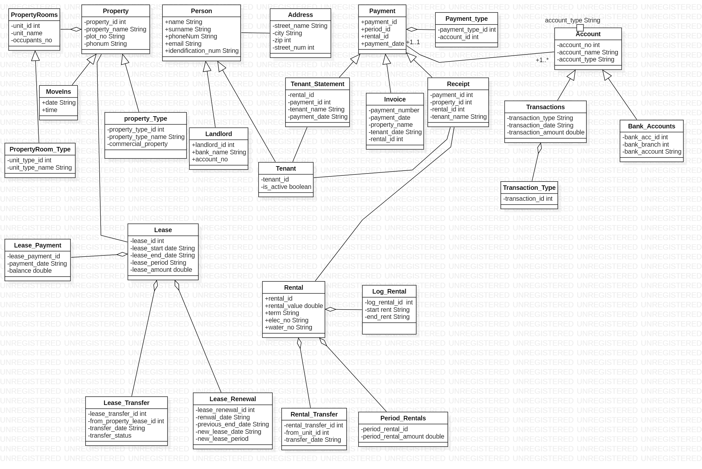

# SystemTomanageflatenants
System that Manage tenants and properties
This system will store everything about tenants, landlord, leases and properties, collect payments and track rent due see what bills have already been paid, what's coming up. It will keep track of contact, lease expirations, lease transfers and lease payments and move-outs. The system will keep accounting and rent roll, payment histories, full statements, invoices, receipts.

